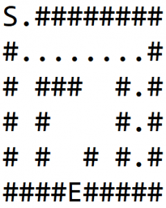
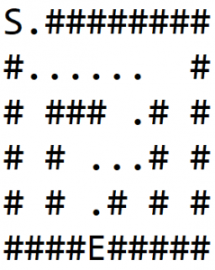
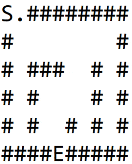

# Um Maze Solver em Java

# 1. Introdução
Neste artigo, exploraremos maneiras possíveis de navegar em um labirinto, usando Java.

Considere o labirinto como uma imagem em preto e branco, com pixels pretos representando paredes e pixels brancos representando um caminho. Dois pixels brancos são especiais, sendo um a entrada para o labirinto e outro a saída.

Dado esse labirinto, queremos encontrar um caminho da entrada até a saída.

# 2. Modelando o Labirinto
Consideraremos o labirinto como uma matriz de inteiros 2D. O significado dos valores numéricos na matriz será conforme a seguinte convenção:

```
0 -> Estrada
1 -> Parede
2 -> Entrada do labirinto
3 -> Saída do labirinto
4 -> Célula parte do caminho de entrada a saída
```
Vamos modelar o labirinto como um gráfico. A entrada e a saída são os dois nós especiais, entre os quais o caminho deve ser determinado.

Um gráfico típico tem duas propriedades, nós e arestas. Uma aresta determina a conectividade do gráfico e vincula um nó a outro.

Portanto, assumiremos quatro arestas implícitas de cada nó, ligando o nó dado a seus nós esquerdo, direito, superior e inferior.

Vamos definir a assinatura do método:

```
public List<Coordinate> solve(Maze maze) {
}
```

A entrada para o método é um labirinto, que contém a matriz 2D, com a convenção de nomenclatura definida acima.

A resposta do método é uma lista de nós, que forma um caminho do nó de entrada ao nó de saída.

# 3. Backtracker recursivo (DFS)
### 3.1. Algoritmo
Uma abordagem bastante óbvia é explorar todos os caminhos possíveis, o que acabará encontrando um caminho, se ele existir. Mas tal abordagem terá complexidade exponencial e não escalará bem.

Porém, é possível customizar a solução de força bruta mencionada acima, retrocedendo e marcando os nós visitados, para obter um caminho em um tempo razoável. Esse algoritmo também é conhecido como pesquisa em profundidade.

Este algoritmo pode ser descrito como:

```
- Se estivermos na parede ou em um nó já visitado, retornar falha;
- Caso contrário, se formos o nó de saída, então retornaremos com sucesso;
- Caso contrário, adicione o nó na lista de caminhos e viaje recursivamente 
nas quatro direções. Se a falha for retornada, remova o nó do caminho e retorne a falha. 
A lista de caminhos conterá um caminho único quando a saída for encontrada.
```

Vamos aplicar esse algoritmo ao labirinto mostrado na Figura-1 (a), onde S é o ponto de partida e E é a saída.

Para cada nó, percorremos cada direção em ordem: direita, inferior, esquerda, superior.

Em 1 (b), exploramos um caminho e batemos na parede. Em seguida, retrocedemos até encontrar um nó que não tenha vizinhos de parede e exploramos outro caminho, conforme mostrado em 1 (c).

Novamente batemos na parede e repetimos o processo para finalmente encontrar a saída, conforme mostrado em 1 (d):





### 3.2. Implementação
Vamos agora ver a implementação Java:

Primeiro, precisamos definir as quatro direções. Podemos definir isso em termos de coordenadas. Essas coordenadas, quando adicionadas a qualquer coordenada dada, retornarão uma das coordenadas vizinhas:

```
private static int[][] DIRECTIONS 
  = { { 0, 1 }, { 1, 0 }, { 0, -1 }, { -1, 0 } };
```

Também precisamos de um método utilitário que adicionará duas coordenadas:

```
private Coordinate getNextCoordinate(
  int row, int col, int i, int j) {
    return new Coordinate(row + i, col + j);
}
```

Agora podemos definir a solução de assinatura do método. A lógica aqui é simples - se houver um caminho de entrada a saída, retorne o caminho, caso contrário, retorne uma lista vazia:

```
public List<Coordinate> solve(Maze maze) {
    List<Coordinate> path = new ArrayList<>();
    if (
      explore(
        maze, 
        maze.getEntry().getX(),
        maze.getEntry().getY(),
        path
      )
      ) {
        return path;
    }
    return Collections.emptyList();
}
```

Vamos definir o método de exploração mencionado acima. Se houver um caminho, retorne verdadeiro, com a lista de coordenadas no caminho do argumento. Este método possui três blocos principais.

Primeiro, descartamos os nós inválidos, ou seja, os nós que estão fora do labirinto ou que fazem parte da parede. Depois disso, marcamos o nó atual como visitado para que não visitemos o mesmo nó repetidamente.

Por fim, nos movemos recursivamente em todas as direções se a saída não for encontrada:

```
private boolean explore(
  Maze maze, int row, int col, List<Coordinate> path) {
    if (
      !maze.isValidLocation(row, col) 
      || maze.isWall(row, col) 
      || maze.isExplored(row, col)
    ) {
        return false;
    }

    path.add(new Coordinate(row, col));
    maze.setVisited(row, col, true);

    if (maze.isExit(row, col)) {
        return true;
    }

    for (int[] direction : DIRECTIONS) {
        Coordinate coordinate = getNextCoordinate(
          row, col, direction[0], direction[1]);
        if (
          explore(
            maze, 
            coordinate.getX(), 
            coordinate.getY(), 
            path
          )
        ) {
            return true;
        }
    }

    path.remove(path.size() - 1);
    return false;
}
```

Esta solução usa o tamanho da pilha até o tamanho do labirinto.

# 4. Variante - Caminho mais curto (BFS)
### 4.1. Algoritmo
O algoritmo recursivo descrito acima encontra o caminho, mas não é necessariamente o caminho mais curto. Para encontrar o caminho mais curto, podemos usar outra abordagem de travessia de gráfico conhecida como pesquisa em amplitude.

No DFS, uma criança e todos os seus netos foram explorados primeiro, antes de passar para outra criança. Já no BFS, exploraremos todos os filhos imediatos antes de passar para os netos. Isso garantirá que todos os nós a uma distância específica do nó pai sejam explorados ao mesmo tempo.

O algoritmo pode ser descrito da seguinte forma:

```
1 - Adicione o nó inicial na fila;
2 - Enquanto a fila não estiver vazia, abra um nó, faça o seguinte:
2.1 - Se atingirmos a parede ou o nó já for visitado, pule para a próxima iteração;
2.2 - Se o nó de saída for alcançado, retroceda do nó atual até o nó inicial para encontrar o caminho mais curto;
2.3 - Caso contrário, adicione todos os vizinhos imediatos nas quatro direções da fila.
```

Uma coisa importante aqui é que os nós devem acompanhar seus pais, ou seja, de onde eles foram adicionados à fila. Isso é importante para encontrar o caminho assim que o nó de saída for encontrado.

A animação a seguir mostra todas as etapas ao explorar um labirinto usando este algoritmo. Podemos observar que todos os nós na mesma distância são explorados primeiro antes de passar para o próximo nível:



### 4.2. Implementação
Vamos agora implementar este algoritmo em Java. Vamos reutilizar a variável DIRECTIONS definida na seção anterior.

Vamos primeiro definir um método utilitário para retroceder de um determinado nó à sua raiz. Isso será usado para rastrear o caminho assim que a saída for encontrada:

```
private List<Coordinate> backtrackPath(
  Coordinate cur) {
    List<Coordinate> path = new ArrayList<>();
    Coordinate iter = cur;

    while (iter != null) {
        path.add(iter);
        iter = iter.parent;
    }

    return path;
}
```

Vamos agora definir o método principal solve. Vamos reutilizar os três blocos usados na implementação do DFS, ou seja, validar o nó, marcar o nó visitado e percorrer os nós vizinhos.

Faremos apenas uma pequena modificação. Em vez de travessia recursiva, usaremos uma estrutura de dados FIFO para rastrear vizinhos e iterar sobre eles:

```
public List<Coordinate> solve(Maze maze) {
    LinkedList<Coordinate> nextToVisit 
      = new LinkedList<>();
    Coordinate start = maze.getEntry();
    nextToVisit.add(start);

    while (!nextToVisit.isEmpty()) {
        Coordinate cur = nextToVisit.remove();

        if (!maze.isValidLocation(cur.getX(), cur.getY()) 
          || maze.isExplored(cur.getX(), cur.getY())
        ) {
            continue;
        }

        if (maze.isWall(cur.getX(), cur.getY())) {
            maze.setVisited(cur.getX(), cur.getY(), true);
            continue;
        }

        if (maze.isExit(cur.getX(), cur.getY())) {
            return backtrackPath(cur);
        }

        for (int[] direction : DIRECTIONS) {
            Coordinate coordinate 
              = new Coordinate(
                cur.getX() + direction[0], 
                cur.getY() + direction[1], 
                cur
              );
            nextToVisit.add(coordinate);
            maze.setVisited(cur.getX(), cur.getY(), true);
        }
    }
    return Collections.emptyList();
}
```

# 5. Conclusão
Neste tutorial, descrevemos dois algoritmos de gráfico principais Pesquisa em profundidade e Pesquisa em largura primeiro para resolver um labirinto. Também mencionamos como o BFS fornece o caminho mais curto da entrada até a saída.

Para ler mais, procure outros métodos para resolver um labirinto, como o algoritmo A * e Dijkstra.
